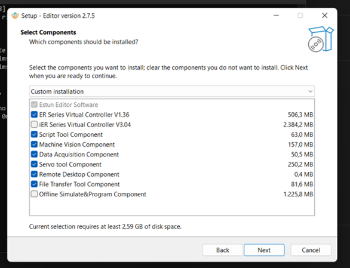
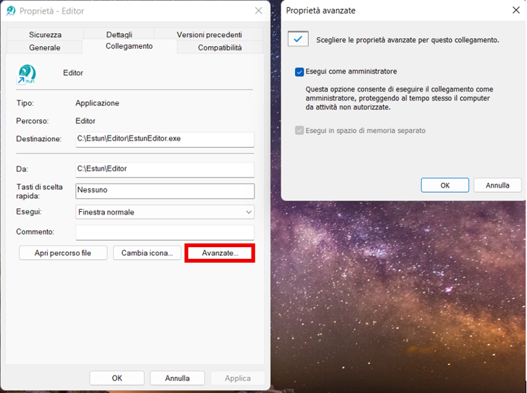

# 1. Install Estun Editor

Estun robots are programmed with **Estun Editor**, which requires Windows 10 or later.

## Install the software

1. Download the installer from the course WeBeep page and run it.
2. Follow the guided installation.
3. Install the application exactly at `C:\Estun`.

{: .warning }
> **Required path:** Estun Editor must be installed in `C:\Estun`. Some functions will not work if it is installed elsewhere.

To save disk space, the **iER Series Virtual Controller** and **Offline Simulate & Program Component** may be omitted (see image below).

## 2. Run as administrator

Always start Estun Editor with administrator privileges. You can set this in the application's Windows compatibility properties so it is applied by default (see image below).

{: .note }
> For a complete reference, consult *iER Series Operation Manual of ESTUN Editor Software.pdf*. A built-in quick guide is also available in the Estun Editor from **Help → Quick start guide for software**.
