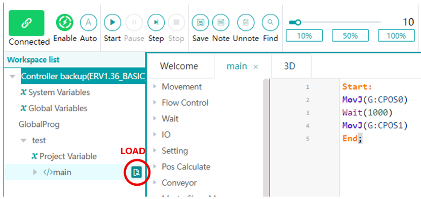

# Robot programming

## Create a project

Right-click the controller, select **New Project**, and enter a project name. 

Estun Editor creates a main program automatically. 

Save with **Ctrl+S** or by right-clicking the controller and choosing **Save All**.

## A minimal example

You can code a minimal program with basic instructions `MovJ` or `MovL` as shown in the image below.

## Variable scope and naming

Use the narrowest useful scope:

| Scope | Prefix | Intended use |
|:--|:--|:--|
| System | `S` | Default speeds and precision zones |
| Global | `G` | System-wide I/O, for example a gripper |
| Project | `P` | Values shared by project programs; avoid when local scope is sufficient |
| Local | `L` | Values used by one script; preferred for most variables |

{: .important }
> Because the editor has limited autocomplete, it is good practice to start a variable name with its type, for example `I_counter` for an integer.

## Run a program

1. Load the program with the icon to its right.
2. Enable the robot motors.
3. Set the robot mode to **Auto**.
4. Press **Play**.

{: .important }
> If **Safety door is not open** or **Start AutoRun failed** appears, see [the troubleshooting section](faq.html#safety-door-and-autorun-errors).

### Video: create a program from Estun Editor

<video controls preload="metadata" playsinline style="width: 100%; max-width: 960px">
  <source src="doc/video_estun_editor/create_program.mp4" type="video/mp4">
  Your browser does not support embedded video. <a href="doc/video_estun_editor/create_program.mp4">Open the video</a>.
</video>

### Video: teach points with the TP

<video controls preload="metadata" playsinline style="width: 100%; max-width: 960px">
  <source src="doc/video_estun_editor/teach_points_TP.mp4" type="video/mp4">
  Your browser does not support embedded video. <a href="doc/video_estun_editor/teach_points_TP.mp4">Open the video</a>.
</video>

### Video: run a program in automatic mode

<video controls preload="metadata" playsinline style="width: 100%; max-width: 960px">
  <source src="doc/video_estun_editor/run_program_auto.mp4" type="video/mp4">
  Your browser does not support embedded video. <a href="doc/video_estun_editor/run_program_auto.mp4">Open the video</a>.
</video>
