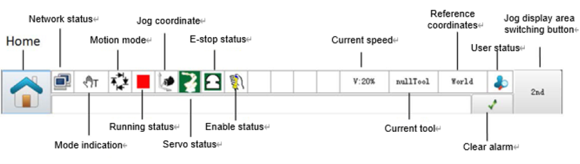
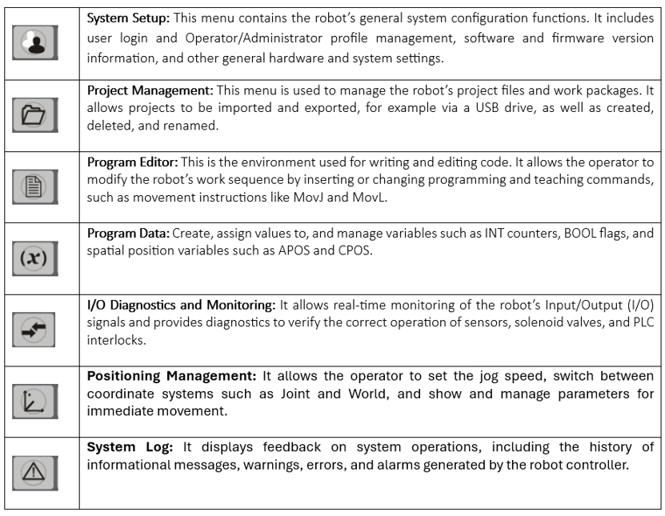
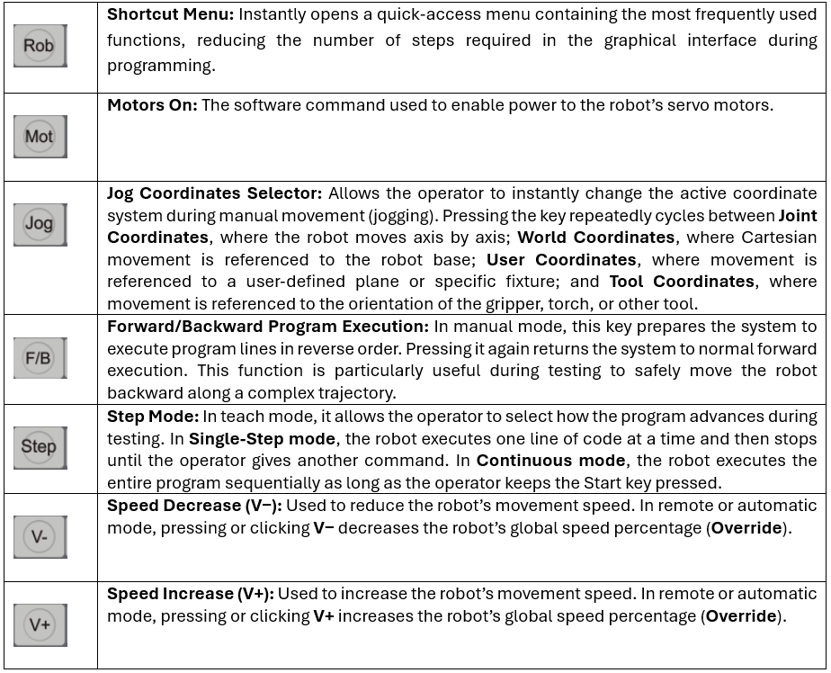

# Teach Pendant

The Teach Pendant (TP) is used to set robot modes, jog the robot, teach positions, inspect status, and edit programs.

## 1. Main functions

Become familiar with the TP before operating a real robot:

- The **status bar** shows the controller state, mode, and active messages.

- The physical **vertical buttons**.

- The physical **horizontal buttons**.

## 2. Create a program and teach poses

1. Go to **Home → Programme → Project → New → New project**.
2. Enter a project name and select **OK**.
3. This is the programming window:
4. In the programming window, select the final `End` line and insert a motion primitive, for example `MovL`.
5. Jog the robot to the desired pose and press **Teach** to record it.

### Video: create a program from the TP

<video controls preload="metadata" playsinline style="width: 100%; max-width: 960px">
  <source src="doc/video_estun_editor/create_program_from_tp.mp4" type="video/mp4">
  Your browser does not support embedded video. <a href="doc/video_estun_editor/create_program_from_tp.mp4">Open the video</a>.
</video>

### Video: teach points with the TP

<video controls preload="metadata" playsinline style="width: 100%; max-width: 960px">
  <source src="doc/video_estun_editor/teach_points_TP.mp4" type="video/mp4">
  Your browser does not support embedded video. <a href="doc/video_estun_editor/teach_points_TP.mp4">Open the video</a>.
</video>

## 3. Execute the program in teach mode

1. Click on the **Start** line.
2. Press **PC** to set the program pointer to the selected line.
3. Hold the physical **Start** button while the program runs.

The robot movement is visible in the simulation window.

### Video: test a program step-by-step in manual mode

<video controls preload="metadata" playsinline style="width: 100%; max-width: 960px">
  <source src="doc/video_estun_editor/run_program_manual.mp4" type="video/mp4">
  Your browser does not support embedded video. <a href="doc/video_estun_editor/run_program_manual.mp4">Open the video</a>.
</video>

## 4. Synchronise the TP and Estun Editor

Programs created on the TP are not automatically visible in Estun Editor. In the editor, right-click the controller and choose **Upload from robot**.

Conversely, after editing code in Estun Editor, choose **Save All**, then refresh the TP to see the changes there.

{: .important }
> Treat the controller/TP and Estun Editor as separate copies until you explicitly synchronise them.
